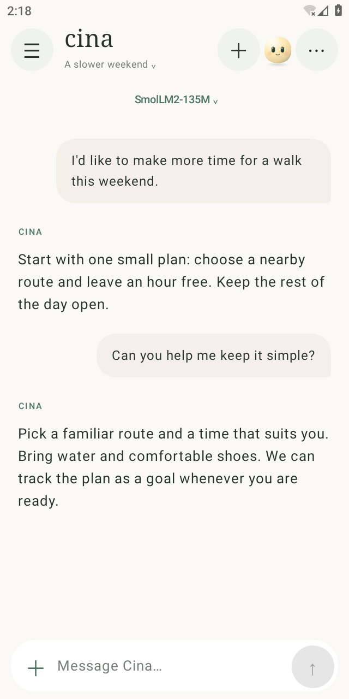
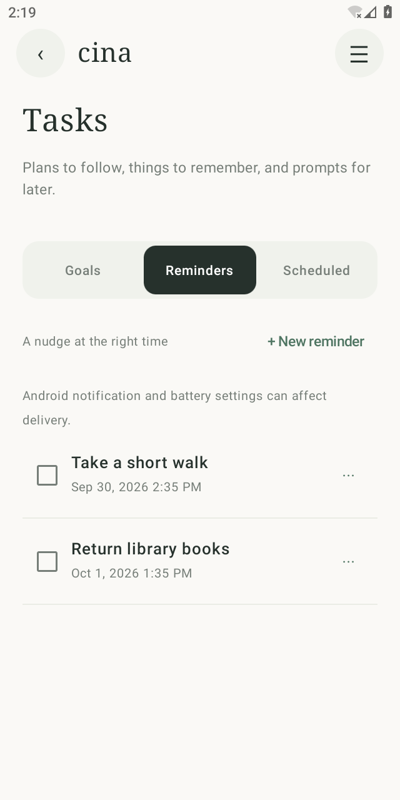
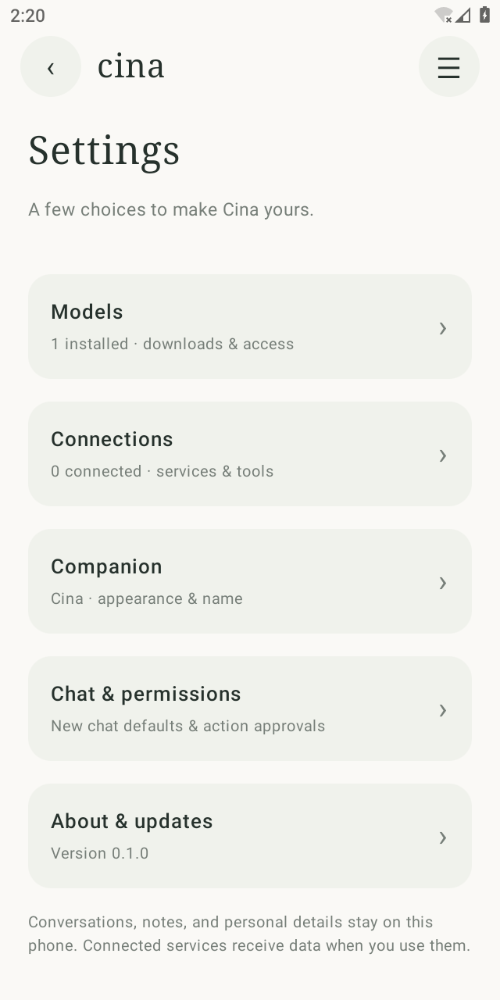

  
  <h1>Cina</h1>
  
<strong>A little space to think, right on your phone.</strong>

Cina is a text-first Android assistant that runs GGUF language models on your phone. It uses the official llama.cpp Android binding, local SQLite storage, and Kotlin/Jetpack Compose. Inference, conversations, notes, reminders, and saved memory stay on the device. Internet search and connected tools are optional and use the network when you enable them.

## A look inside

| Chat | Tasks | Settings |
| :---: | :---: | :---: |
|  |  |  |

Tap a screenshot to see it full size. See the [full UI gallery](preview/ui-refresh/README.md) for navigation, notes, profile, memory, models, and connections. These captures show the Android app running on a disposable emulator with sample local data.

## What Cina can do

- **Readable replies.** Assistant replies render headings, bold and italic text, lists, quotes, strikethrough, tables, and code blocks, including while streaming. Code has a Copy button. HTTP/HTTPS links open in your browser when tapped. Raw HTML stays literal text and images show alt text without downloading anything.

- **Chat privately with local models.** Download recommended GGUF models, browse Hugging Face, import a file, or add a direct model URL. Once a model is installed, ordinary chat works offline. Benchmark an installed model to compare speed and a few short task checks on your phone.
- **Keep useful things close.** Save and search notes, set reminders, and review suggested memories before they become part of future conversations. An optional You profile lets you share the details Cina should remember about you.
- **Work with your files.** Attach a text document or a PDF to a chat. Cina indexes selectable text on the device and can cite the relevant file and passage in its answer.
- **Turn requests into goals.** Start a goal from chat, follow its plan and tool results in Tasks, and return to paused or waiting work. Goals keep their progress across app restarts.
- **Schedule local prompts.** Run a prompt once, daily, or weekly with a chosen on-device model. Cina saves the result and sends a notification when Android allows it.
- **Use helpful tools when you choose.** Search the web, create notes and reminders, or connect an HTTPS MCP service. Cina asks before actions that create or share data, unless you enable YOLO mode for that chat.
- **Reach Cina from the home screen.** Quick Note, Ask Cina, and Today widgets help you capture a thought, start a chat, or glance at upcoming reminders and the latest scheduled result.
- **Personalize the companion.** Choose its name, colours, eyes, hat, mouth, and accessories, including a custom colour, and set how Cina should respond.

## Build

Requirements: Android SDK platform 36, NDK 29.0.13113456, CMake 3.31.6, JDK 21, and an arm64-v8a Android 10+ phone. `vendor/llama.cpp` is pinned as a submodule at upstream commit `66e665c4276ee46f3ec9872dd7e5a496842bc44f`. Clone with `git clone --recurse-submodules`, or run `git submodule update --init` after cloning.

Run `gradlew.bat :app:assembleDebug`. The debug APK is generated at `app/build/outputs/apk/debug/app-debug.apk`.

## APK releases and updates

Each push to `main` runs [the APK workflow](.github/workflows/android-apk.yml). It builds an arm64 release APK, stores it as a workflow artifact, and publishes it as the latest GitHub Release. The build number increases on every workflow run. Cina checks the latest release when opened, prompts when its build number is newer, and opens the APK download when you choose **Download**. You can also check from **Settings**. If the phone blocks installation, allow APK installs from the browser or file manager you used to open the download.

Before the first release, create and safely back up a dedicated Android signing keystore. Add these four repository secrets under **Settings → Secrets and variables → Actions**:

| Secret | Value |
| --- | --- |
| `CINA_KEYSTORE_BASE64` | Base64 encoding of the complete keystore file (no line breaks) |
| `CINA_KEY_ALIAS` | Alias of the signing key in that keystore |
| `CINA_KEYSTORE_PASSWORD` | Keystore password |
| `CINA_KEY_PASSWORD` | Key password |

On Windows, you can encode the keystore with `[Convert]::ToBase64String([IO.File]::ReadAllBytes('C:\path\to\cina-release.jks'))` in PowerShell. Keep the keystore and passwords backed up securely: future APKs need the same key to install over existing releases. The workflow stops before building if any signing secret is missing. APKs made by `assembleDebug` have a different signing key and cannot update to these release APKs without first uninstalling the debug app; uninstalling deletes its local app data. Install the first signed release to receive in-app update prompts for later builds.

## Navigation

- **Chat:** conversations and attached files, with a compact message composer. The **+** menu contains **Attach a file** and **Track as goal**; typing no longer adds an extra button row.
- **Tasks:** separate **Goals**, **Reminders**, and **Scheduled** tabs. Goals continue in chat; reminders notify you; scheduled prompts run on the phone in the background. Add and edit reminders directly, or create them through chat.
- **Notes:** search, read, and edit saved notes. New notes open in a focused editor.
- **You:** **About you** and **Memory** tabs, including response preferences and memory suggestions for review.
- **Settings:** compact categories for models, connections, companion appearance, chat and permissions, and updates. Models has **Installed** and **Discover** views; connections lists saved services and puts available presets behind **Add**.

## First run

1. Open **Models** and download a recommended model, search a Hugging Face GGUF repository, paste a direct HTTPS GGUF URL, or import a local GGUF file.
2. Select an installed model. Chat works without network access after the model is installed.
3. In a chat, enable **Web** only if you want internet search. Cina searches DuckDuckGo without an API key. You can add a Brave Search API key in **Settings** as a fallback. Gated Hugging Face files require account approval and a token entered in Settings.
4. Notes, reminders, and scheduled tasks are stored inside Cina. In **Tasks → Scheduled**, choose a prompt, model, time, and optional daily or weekly repeat. Cina runs the prompt on the phone, can use its local note, reminder, and task tools, and notifies you of the saved result. Calendar, alarm, and share actions open Android system apps for the final user step.
5. To use remote tools, open **Settings → Connections**. For Linear, choose **Sign in with Linear** and approve access in your browser. Other services currently use an access token. Cina checks the connection and loads the server's tool list. Disconnecting deletes saved credentials.

## Home-screen widgets

Long-press the Android home screen, open **Widgets**, and find **Cina**. **Quick Note** opens a focused editor and saves the text directly to Notes; its first line becomes the title. **Ask Cina** opens a prompt field and sends the text in a new chat when you press Send. If no model is selected, the prompt stays in the new chat's input field so you can choose a model first. **Today** shows the next two open reminders and the latest scheduled task result. Tap the reminder area to open **Tasks → Reminders**, or the task result to open **Tasks → Scheduled**.

## Goals, files, memory, and model benchmarks

- Type a request in chat, tap **+**, and choose **Track as goal** to track it in **Tasks → Goals**. Cina saves tool results and approval checkpoints with the goal. You can return to a paused or waiting goal, follow up, or mark it complete. Goal execution runs while the chat is active; closing the app preserves progress but does not keep that goal running in the background. Scheduled tasks remain a separate feature.
- Tap **+ → Attach a file** beside the chat input to add a text document or a PDF. Cina extracts and indexes selectable text locally, searches relevant passages when you ask about the file, and identifies the file and passage in its response. Supported text files include TXT, Markdown, CSV, JSON, XML, HTML, and logs. Files are limited to 8 MB; extracted text is limited to 250,000 characters. Scanned PDFs and images need OCR and are not supported yet. The searchable text is stored with the chat on this phone.
- **You → Memory** shows proposed personal facts for review before saving them. Suggestions and saved facts show their source conversation. Cina also maintains a short rolling summary of older conversation turns for continuity.
- In **Settings → Models → Installed**, open a model’s details and choose **Benchmark** to measure generation speed on this phone and run three short Cina task checks. The recommendation is based only on these checks and speed; test real requests before relying on a model for important work.

## Remote MCP tools

Cina includes ten hosted MCP presets: Gmail, Google Drive, Google Docs, Google Sheets, Google Slides, Google Calendar, Google Chat, Google Contacts (People API), GitHub, and Linear. You can also add an arbitrary HTTPS Streamable HTTP MCP endpoint in Settings with a name, URL, and optional bearer token. For a Claude or Codex configuration that contains a remote `url`, use that URL. A `command`/`args` configuration describes a local `stdio` server and cannot run inside Cina on Android; host that server behind an HTTPS MCP endpoint first. Cina stores custom connections on the device and removes their credentials when disconnected or removed. Linear supports browser based OAuth sign-in with automatic token renewal, as well as manual API keys or OAuth tokens. Google Workspace MCP requires a configured Google Cloud project and OAuth authorization; a pasted Google access token expires, so renew it in Settings when needed. GitHub accepts a personal access token. Presets are connection options, not accounts connected by default.

Connected servers receive only the arguments of tools Cina calls. Tokens are encrypted with Android Keystore, never included in model prompts or action logs, and removed on disconnect. Cina discovers tool names and input schemas from the server, can search them during a chat, and asks for approval before each remote tool call unless that chat has YOLO mode enabled. Remote server responses are treated as untrusted data. The MCP client supports HTTPS Streamable HTTP with the 2026-07-28 protocol and a legacy handshake fallback. It does not run local `stdio` MCP servers or legacy HTTP+SSE endpoints. Interactive OAuth is currently available for Linear only; other servers that require browser OAuth need an existing token or a future provider-specific sign-in integration.

The assistant requests confirmation before creating or sharing data, including scheduled tasks created through chat. Per-chat YOLO mode skips these confirmations for the app's available tools and displays an action log. It turns off when the app leaves the foreground or the user changes chats. Chat is the home screen. The side menu contains **Chat**, **Tasks**, **Notes**, **You**, and **Settings**. Tasks groups goals, reminders, and scheduled prompts in separate tabs. You brings together your profile, response preferences, and reviewed memories. Settings opens focused screens for models, connections, companion appearance, chat permissions, and updates. Tap the model name in chat to switch between installed models or manage downloads. The companion avatar opens its appearance editor directly.

## Current boundaries

- GGUF text chat models only. Import validation checks GGUF structure; llama.cpp decides whether an architecture can run on this device.
- Reminder notifications are inexact and depend on Android notification permission and battery policy.
- Scheduled tasks run locally through Android's persistent work scheduler, so the actual start time can be later than requested. Each run can make up to three local tool calls and produces a text response; connected-tool and Android screen actions are unavailable in the background. The selected model must remain on the phone. Long model runs can be interrupted by Android and may need another attempt.
- Web search sends its query to DuckDuckGo. If that search fails and a Brave key is saved, Cina retries with Brave. Search results are treated as untrusted input to the local model.
- No cloud inference, voice, accessibility automation, or background autonomous agent. Connected MCP services do exchange data with their providers when used.
- Goals survive app restarts, but only scheduled tasks execute while the chat is closed. Attached files are currently indexed by extracted text; scanned pages, images, and other binary formats are not interpreted.
- Device performance and memory use vary by model. The app gives an estimate before download; test on target phones before distribution.
