# UI refresh screenshots

Real captures from Cina running on an Android 10 (API 29) emulator at 640 × 1280. The disposable emulator contains sample conversations, notes, reminders, goals, memories, and disabled schedules. Conversation replies and saved schedule results are fixtures, not measured model output. The installed SmolLM2 model is a real GGUF file.

## Chat

The composer stays on one row. **Track as goal** lives in the **+** action menu, alongside attachments. The model selector opens a quick switcher; history opens from the conversation title.

| Conversation | Typing | Goal action |
| --- | --- | --- |
|  | <a href="chat-draft.png">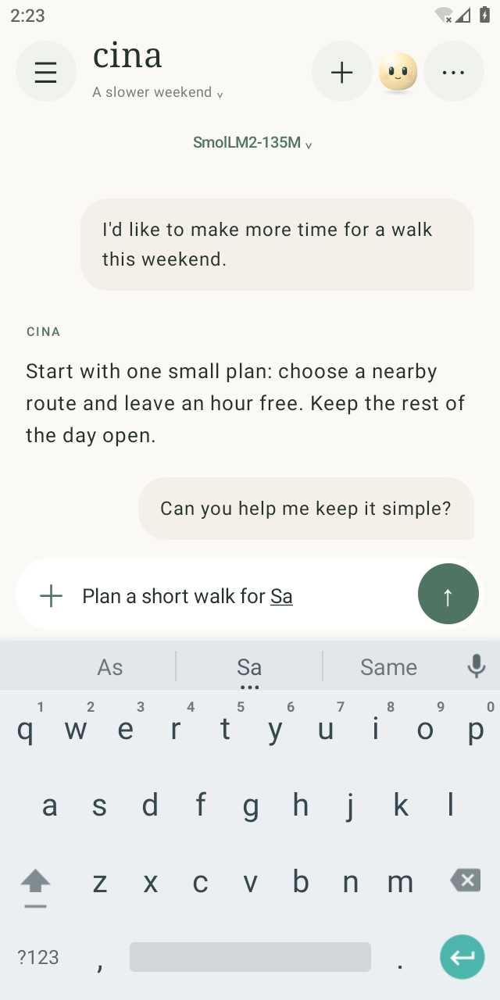</a> | <a href="chat-actions.png">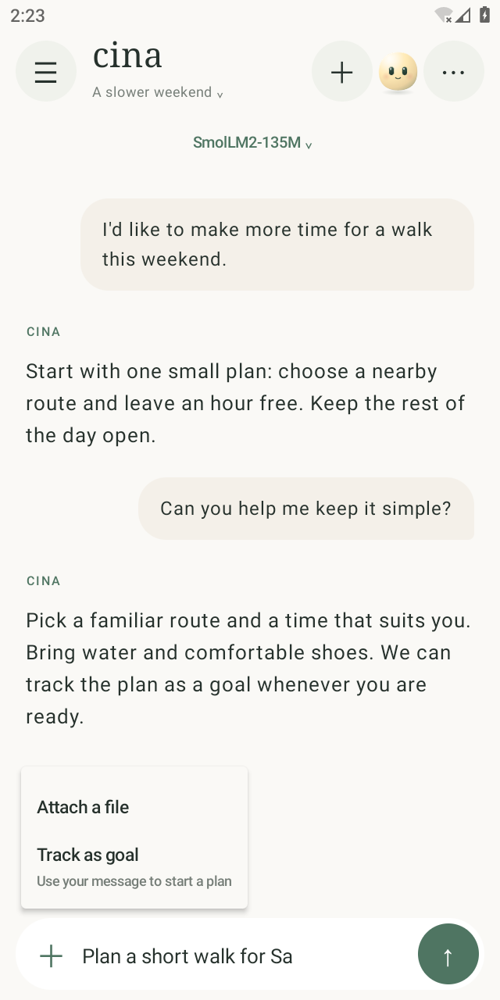</a> |

## Formatted model replies

Assistant output renders an approved Markdown subset using native Compose text: headings, emphasis, lists, quotes, strikethrough, tables, inline code, and fenced code. Code is selectable and has a Copy button. Tables and long code scroll horizontally. Only HTTP/HTTPS links are clickable; HTML stays literal and image URLs are never fetched.

| Headings, lists, and code | Tables and inline formatting |
| --- | --- |
| <a href="chat-markdown.png">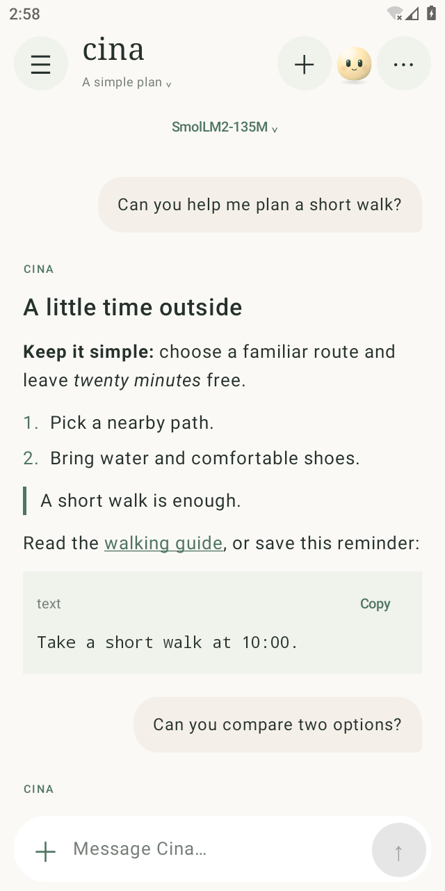</a> | <a href="chat-markdown-table.png">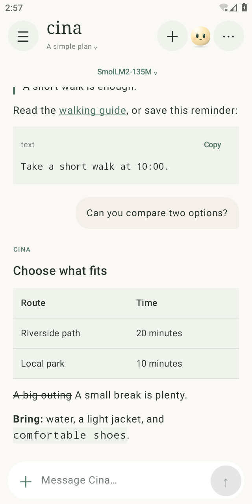</a> |

The Markdown replies shown here are sample fixtures on the same disposable emulator.

## Navigation and tasks

Five destinations: Chat, Tasks, Notes, You, and Settings. Tasks keeps goals, reminders, and scheduled prompts in distinct tabs.

| Navigation | Goals | Reminders | Scheduled |
| --- | --- | --- | --- |
| <a href="navigation.png">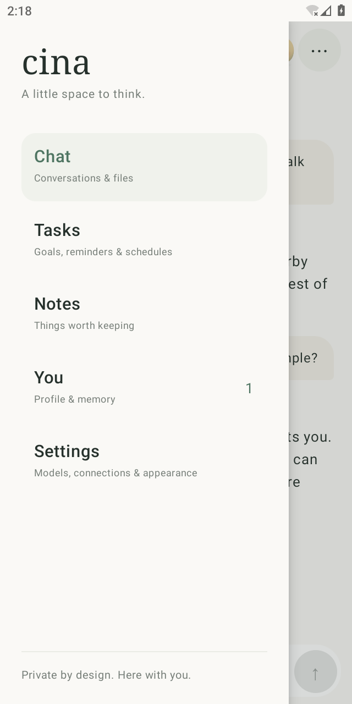</a> | <a href="goals.png">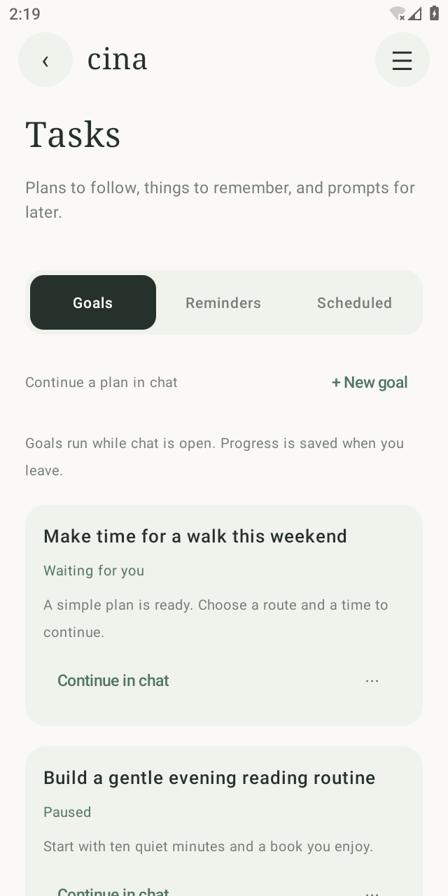</a> |  | <a href="scheduled.png">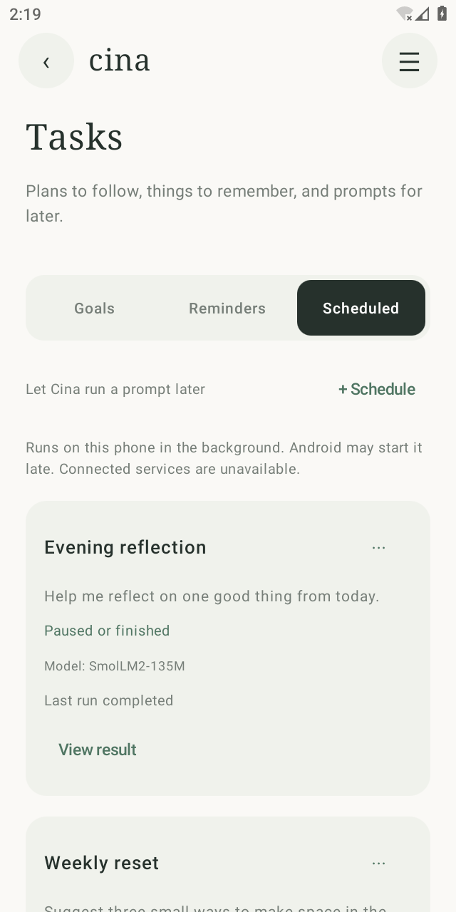</a> |

## Personal information

| Notes | You | Memory |
| --- | --- | --- |
| <a href="notes.png">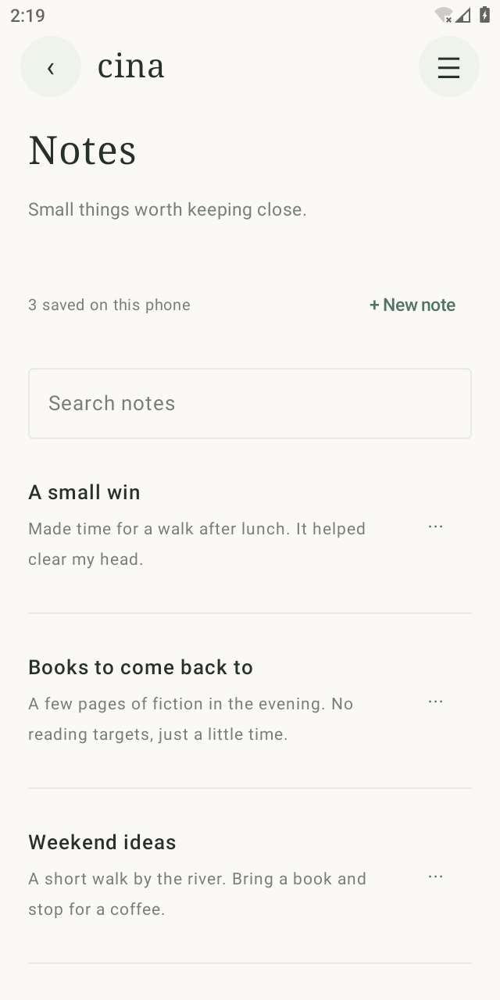</a> | <a href="you.png">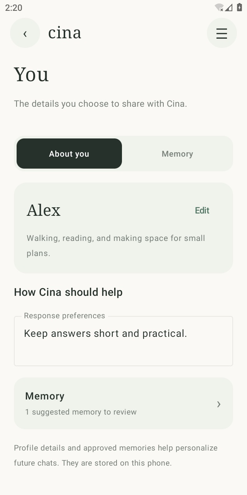</a> | <a href="memory.png">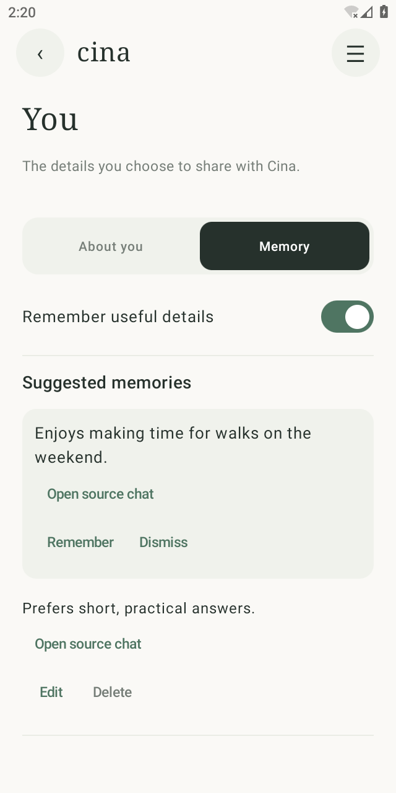</a> |

## Settings

| Categories | Models | Connections |
| --- | --- | --- |
|  | <a href="models.png">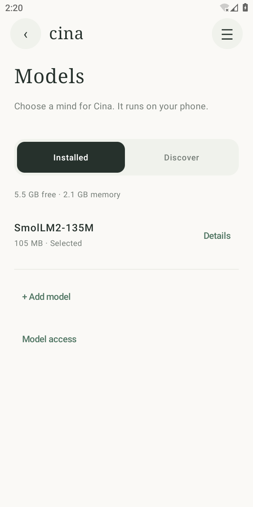</a> | <a href="connections.png">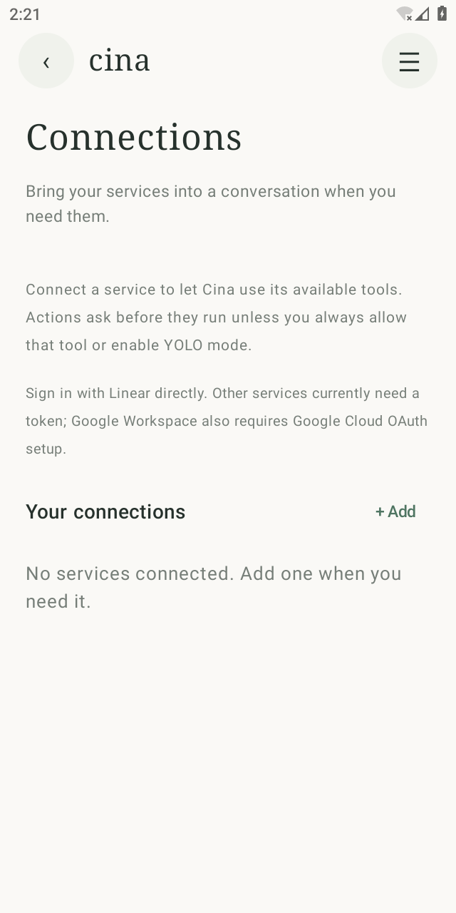</a> |

## Validation

- Native x86_64 debug APK and Android test APK built successfully.
- Android lint completed with no errors.
- Six Compose instrumented tests passed on the emulator: five destinations, compact chat actions and draft retention through model management, separate drafts per conversation, Memory navigation, and reminder/scheduled notification destinations.
- Markdown validation: five unit tests passed for nested formatting, approved links, inert HTML/images, unfinished streaming input, tables, and strikethrough. Two additional emulator tests passed for rendered formatting and exact code copying, plus streaming updates and the separate thinking panel.

Build configuration: `:app:assembleDebug :app:assembleDebugAndroidTest :app:lintDebug -Pemulator -Pandroid.injected.build.abi=x86_64`. Tests were executed with `adb shell am instrument` using AndroidJUnitRunner. This review does not benchmark model quality or validate live external service credentials.
